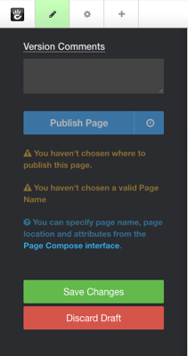

# Creating New Pages

## To create a new page

1. Select the **Pages \(Pages Icon\)** button on the right of the toolbar.
2. A list of different page types will be presented under the _New Page_ heading.

   Your site is likely to be configured with multiple page types for different purposes.

3. Select the type of page you wish to add, or for a generic new page select **Empty Page** or **Page**.

At this point depending on the page type you may be presented with two different ways to continue adding content to the new page:

## To publish a page set up for 'Composer'

If the page you have selected has been configured for 'Composer' editing, you will be presented with a new form with the title 'Composer' and the name of the page you have selected.

Complete the form presented and select the blue **Publish** button.

## To publish a page that is directly editable

Page types may also be configured to be initially created through direct editing. In this case after selecting a page type the page will be _immediately_ presented in edit mode. When creating a page this way:

1. Add page content by adding blocks or editing any default blocks
2. Select the **Edit Page \(Pencil\)** button on the top left of the tool bar and publish your new page.

When you create a page this way and try to publish it you wil be presented with a message that you haven't entered a page name or selected its location. To complete:

1. Select the **Page Composer Interface** link. This will bring up the 'Composer' interface where you can enter details for the new page, including selecting the desired location of the new page within the site.
2. Complete these details and press the **Publish** button.

## To edit a page created via the Composer

Pages created via the Composer form can still be edited via the normal editing method. However, the special fields need to be edited by clicking on the **Page Settings** button on the tool bar and selecting **Composer** from the panel. The Composer form will be presented again, where you can make further edits and Publish the page.

